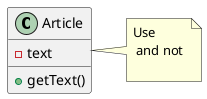
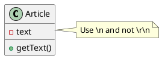
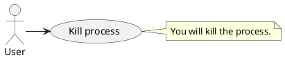

I am a regular user of PlantUML, as such, sometimes I am confronted to escape
special character in my diagrams, in this post I show you how to do it.

## Escaping newline

Escaping a newline `\n` in PlantUML is easy, you have to write a second
backslash `\\n`.

Let's see an example, in the following PlantUML diagram I want to
write `Use \n and not \r\n.` but the result is not the expected one:




To fix this we escape backslash character using a second backslash for `\n` and
for `\r` as well, therefore this is the string we have to
use `Use \\n and not \\r\\n.`. This is the final result:




## Escaping other characters

The real problem comes with another characters depending where they are used.



double backslash will not work,

use it's unicode version:

```
<U+005C><U+005C>host<U+005C>folder
```


## Conclusion

First try to escape your character with a
backslash, this will work
with [other character too](https://github.com/plantuml/plantuml/issues/125).
