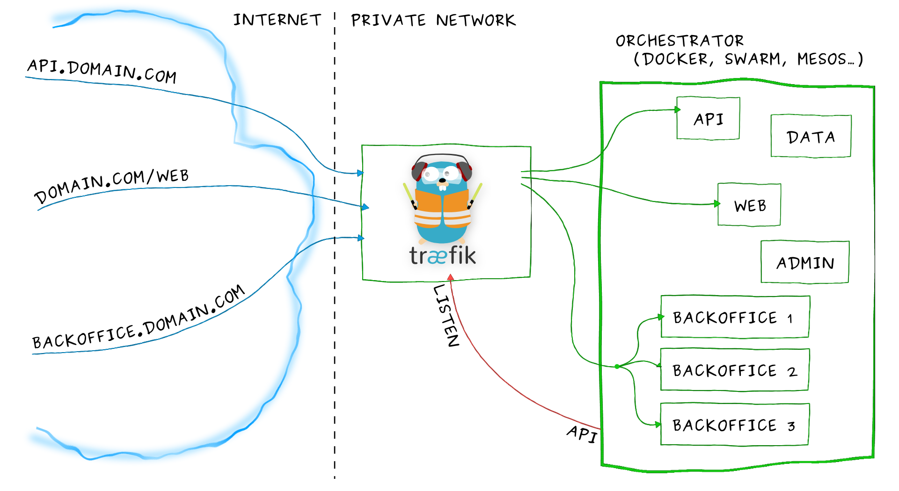

[Traefik](https://traefik.io/traefik/) is a reverse http proxy, it works
specially well with [docker](https://www.docker.com/)
and [docker-compose](https://docs.docker.com/compose/) environments. Traefik
will receive all your incoming web requests and redirect them to Docker
containers.



In order to redirect your requests, Traefik will use a router to identify the
appropriate web server.

In this article I show you how I configured a default "Host rule" for my
development environment. This rule will automatically add a rule for any
service.

- **`http://<service>.<project>.localhost`**

I assume you already have some experience with Docker and Traefik.

## Traefik configuration

First install Traefik. Let's create a new project with the following structure:

```
traefik/
└── docker-compose.yaml
```

You only need one single file to start using Traefik. This is the content
of `traefik/docker-compose.yaml`:

```yaml
version: '3.7'
services:

  traefik:
    image: traefik:v2.7
    restart: always
    command:
      - '--api.insecure=true'
      - '--providers.docker.exposedByDefault=false'
      - '--providers.docker.network=traefik_default'
      - '--providers.docker.defaultRule=Host(`{{ index .Labels "com.docker.compose.service" }}.{{ index .Labels "com.docker.compose.project" }}.localhost`)'
    labels:
      - 'traefik.http.services.traefik-traefik.loadBalancer.server.port=8080'
      - 'traefik.enable=true'
    ports:
      - '80:80'
      - '8080:8080'
    volumes:
      - '/var/run/docker.sock:/var/run/docker.sock'
    networks:
      - default

networks:
  default:
```

This is the most important command option when creating dynamic rules:

```yaml
- '--providers.docker.defaultRule=Host(`{{ index .Labels "com.docker.compose.service" }}.{{ index .Labels "com.docker.compose.project" }}.localhost`)'
```

Let's see what the previous line does:

- **--providers.docker.defaultRule**: this is the rule to be used if container
  doesn't define one.
- **Host()**: the requested domain will be used for routing.
- **`{{ index .Labels "com.docker.compose.service" }}`**: this represents the
  service name, the one you define in `docker-compose.yaml`.
- **`{{ index .Labels "com.docker.compose.project" }}`**: this placeholder will
  be replaced with project name. By default, the project name is the directory
  name, you can also specify this value with `-p <project>` option.
- Finally **`.localhost`**
  is [a reserved domain](https://datatracker.ietf.org/doc/html/rfc2606), it will
  always point to the loopback address **`127.0.0.1`**. Using `.localhost`, you
  will not need to add your development domains to `/etc/hosts`.

Start Traefik with the following command:

```console
$ docker compose -p traefik up -d
```

Traefik is up and running now.

## Creating a sample project

We will create a demo project to check if our dynamic rules work properly. This
is the structure of `foo` project:

```
foo/
└── docker-compose.yaml
```

We define an Apache server within `foo/docker-compose.yaml`:

```yaml
version: "3.7"
services:

  web:
    image: httpd
    labels:
      - traefik.enable=true
    networks:
      - default
      - traefik_default

networks:
  default:
  traefik_default:
    external: true
```

Let's execute our demo project:

```console
$ docker compose -p foo up -d
```

Now, if we open `http://web.foo.localhost` we will see Apache's welcome message:


## Using a custom rule

We can also specify a custom rule for a service, this custom rule will override
the default rule.

For example we want to use `my-foo.localhost`, to do so we simple add a
new `label`:

```diff
# ...
  web:
    image: httpd
    labels:
      - traefik.enable=true
+     - traefik.http.routers.foo-project.rule=Host(`my-foo.localhost`)
# ...
```

To make changes take effect we have to launch again our project
using `docker compose -p foo up -d`. This is the result:


As you can see everything works as expected.

## Conclusion

Traefik is a highly configurable reverse proxy. You only need one line of code
to have dynamic domains, these domains are well suited for development
environments.

If you use `.localhost` tld, you won't need to declare your domains
within `/etc/hosts`.
