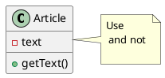
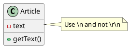
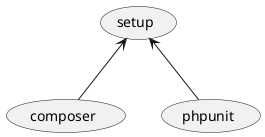
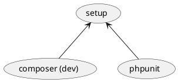

I am a regular user of PlantUML, as such, sometimes I am confronted to escape
special character in my diagrams, in this post I show you how to do it.

## Escaping newline

Escaping a newline `\n` in PlantUML is easy, you have to write a second
backslash `\\n`. This also works for `\r` character.

Let's see an example, in the following PlantUML diagram I want to
write `Use \n and not \r\n.` but the result is not the expected one:




To fix this we escape backslash character using a second backslash for `\n` and
for `\r` as well, therefore this is the string we have to
use `Use \\n and not \\r\\n.`. This is the final result:




## Escaping other characters

The real problem comes with another characters, depending on the type a diagram,
a character might Let see an example, in the following diagram we want to
replace `composer` by `composer (dev)`, we can't simply add the aditional text
since parentheses are used to crate the oval shape simply adding `(dev)` will
generate a syntax error.




The solution is to use **Unicode codepoints**, with codepoints you can write any
character without creating a syntax error. In our example we must use the
following codepoints:

1. `(` can be written as `<U+0028>`
2. and `)` can be written as `<U+0029>`

So our final code is:




## Getting a character's codepoint

When you need to get the endpoint of certain character, you can search in
internet, for example you can use <https://codepoints.net/>.

If you want to get the codepoint using PHP, then you can use the following code
snippet:

```php
// codepoint.php
$character = 'Ñ';
$codepoint = str_pad(dechex(IntlChar::ord($character)), 4, '0', STR_PAD_LEFT);
echo "<U+$codepoint>", PHP_EOL; // <U+00d1>
```

## Conclusion

When confronted with a syntax error, first try to escape that character
with `\` because, besides `\r` and `\n`, other character can also can
[be escaped with backslash](https://github.com/plantuml/plantuml/issues/125).
If backslash doesn't work then you must use unicode codepoints.
