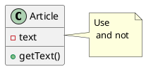
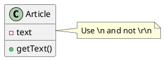
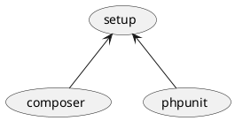
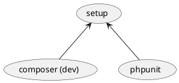

I am a regular PlantUML user. Sometimes, I need to escape special characters in
my diagrams. In this post, I'll show you how to do it.

## Escaping newlines

Escaping a newline `\n` in PlantUML is easy; you simply write a second backslash
`\\n`. This also works for the `\r` character.

Let's see an example. In the following PlantUML diagram, I want to write
`Use \n and not \r\n.` but the result is not what we expect:


```plantuml
@startuml
class Article {
- text
+ getText()
}
note "Use \n and not \r\n" as N2
Article . N2
@enduml
```


To fix this, we escape the backslash character using a second backslash for both
`\n` and `\r`. Thus, use the string `Use \\n and not \\r\\n.` This is the final
result:


```plantuml
@startuml
class Article {
- text
+ getText()
}
note "Use \\n and not \\r\\n" as N2
Article . N2
@enduml
```


## Escaping other characters

The real problem arises with other characters, depending on the diagram type.
Let's see an example. In the following diagram, we want to replace `composer`
with `composer (dev)`. We cannot simply add the additional text, since
parentheses are used to create the oval shape. Simply adding `(dev)` will
generate a syntax error.


```plantuml
@startuml
(setup) <-- (composer)
(setup) <-- (phpunit)
@enduml
```


The solution is to use **Unicode codepoints**. Using codepoints, you can write
any character without creating a syntax error. In our example, we must use the
following codepoints:

1. `(` can be written as `<U+0028>`
2. `)` can be written as `<U+0029>`

Here is our final code:


```plantuml
@startuml
(setup) <-- (composer <U+0028>dev<U+0029>)
(setup) <-- (phpunit)
@enduml
```


## Getting a character's codepoint

When you need to get the codepoint for a character, you can search the internet.
For example, you can use [codepoints.net](https://codepoints.net/).

As an alternative, you can also get the codepoint using PHP, you can use the
following code snippet:

```php
// codepoint.php
$character = 'Ñ';
$codepoint = str_pad(dechex(IntlChar::ord($character)), 4, '0', STR_PAD_LEFT);
echo "<U+$codepoint>", PHP_EOL; // <U+00D1>
```

## Conclusion

When confronted with a syntax error, first try to escape the character with `\`.
Besides `\r` and
`\n`, [other characters can also be escaped with a backslash](https://github.com/plantuml/plantuml/issues/125).
If the backslash doesn't work, then you must use Unicode codepoints.
